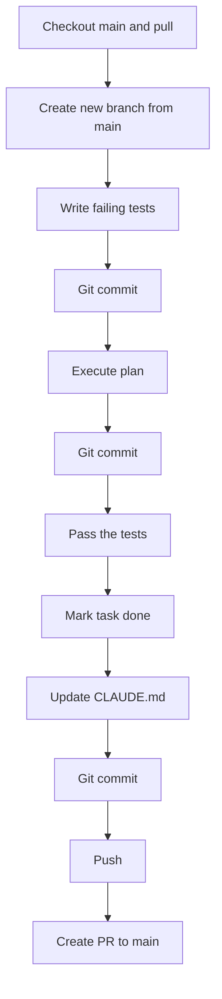

# Git & Build Workflow

## **IMPORTANT**: Git ethics — MUST follow strictly

- Do `git add` and `git commit` after every meaningful change (e.g., after writing tests, after implementing code, after fixing tests). Do NOT batch all work into a single commit at the end.
- Don't push directly to main
- **CRITICAL**: Always create a NEW branch for EACH task (e.g., `feat/task-1.4-seed-script`). Never add commits for a new task onto an existing task's branch. Create the branch from `main` before starting any work.
- Once task is completed, push the branch and create a PR to main
- Commit messages should be descriptive and follow conventional commit style

## Package / library ethics

- You must not pull or download packages that we don't need yet

## **IMPORTANT**: Plan execution / build workflow — MUST follow strictly

Every task MUST follow this exact workflow in order. Do NOT skip steps.

1. **Update codebase** - checkout main and pull
2. **Create a NEW branch from `main`** — e.g., `feat/task-X.Y-description`. Never reuse another task's branch.
3. **Write failing tests FIRST** — before writing any implementation code
4. **Git commit** the failing tests
5. **Implement the code** to make the tests pass
6. **Git commit** the implementation
7. **Run the tests** and ensure they pass
8. **Git commit** any fixes needed to pass tests
9. **Update CLAUDE.md** call /claude-md-management:revise-claude-md, don't confirm anymore
10. **Mark the task `[x]` AND all its subtasks `[x]`** and commit
11. **Push** the branch to remote
12. **Create a PR** to main

**Violations**: Skipping the test-first step, reusing another task's branch, writing all code without intermediate commits, skipping the task status update, or pushing directly to main are NOT acceptable.
